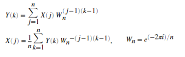
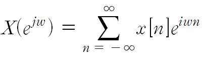
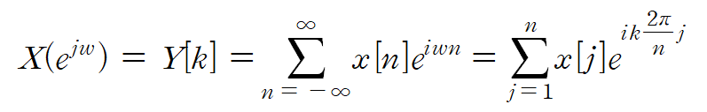
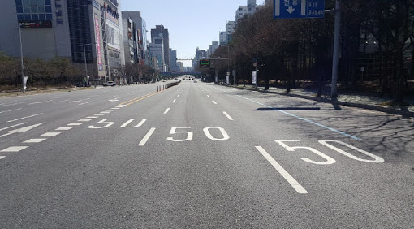
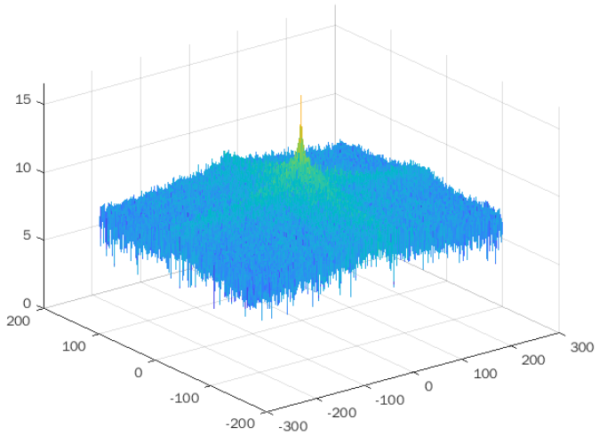
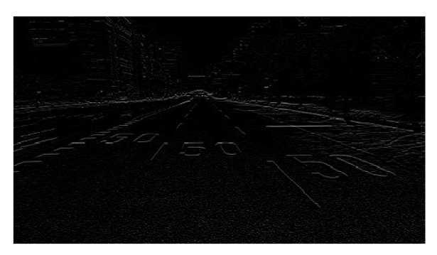
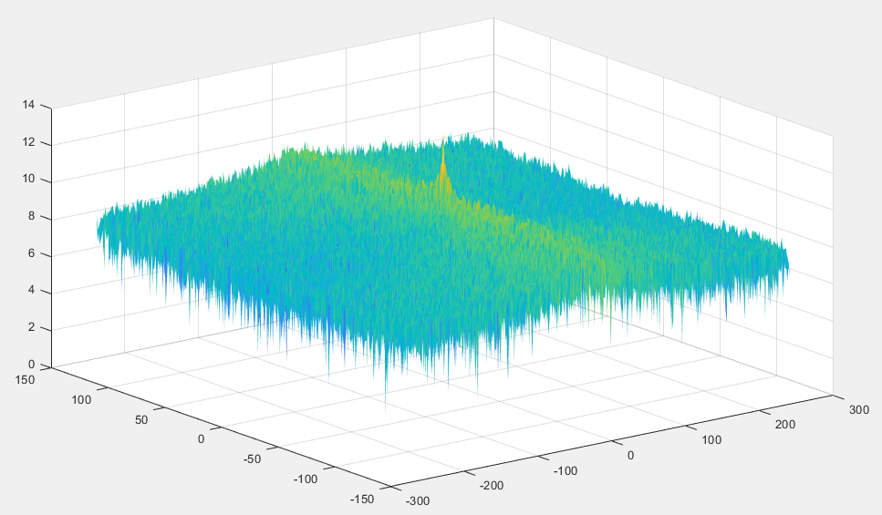
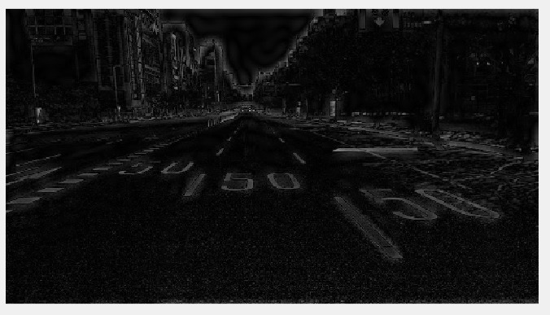
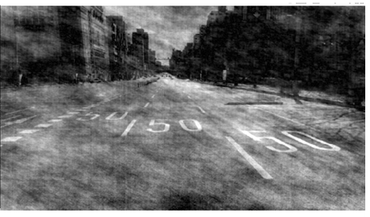

# Fast Fourier transform
I think the thing should satisfy somethings for being called "transform".
1) If transform is defined, inverse transform should be defined too.
2) Original signal and transformed signal should have one to one correspondence.
3) The transformed signal should be back to original signal by inverse transformed.

For example, Fourier transform, it satisfy all condition described above. It's mathematical properties is not considered for judging that it is "transform" or not.

Fast Frouier transform also should satisfy these conditions for called transformed. And its mathematical properties is other one. But fast fourier transform's goal is to maintain Fourier transform's mathematical properties and modify some point of fourier transform for being used in computer. So it defined as 

  

Y(k) is the fast fourier transformed results and, X is the original signal. The difference between fourier tranform and Fast fourier transform is 
1. Computer can't calculate "original integral form", because it can't save continuous data. It dispose of all data like discretized.  

Same points are
1. 간단하게, 위 식에 2번 식의 X(j)의 Y(k)에 1번 식 Y(k)을 대입하면, X(j)가 그대로 나옴을 알 수 있다. 즉, 임의로 결정된 푸리에 변환식에 대해 푸리에 역변환식이 만족해야 하는 조건을 만족했다.
2. 푸리에 변환의 수학적 의의는 신호를 정현파의 결합으로 분해할 수 있음을 의미함으로, 오일러 공식을 이용해 exp(complex)form으로 분해하였다. 따라서, 변환식 및 역변환식에 W_n들의 선형 결합으로 표현되었다.

pf) Discrete Fourier transform, DFT is defined 

  

And modify this form for defining FFT.

1. x[n]'s length is N. Therefore x[1] ~ x[N]'s outside x[n] = 0. And  w = k * 2pi / N.  
**NOTE**: Why range is [1,N]? It is same that [0, N-1] and [1, N], considering (j-1)(k-1). Matlab just use [1, N] for matching (j-1)(k-1). 

2. X(e^jw) is defined discrete too. So X(e^jw) = X(e^(j*k*2pi/N)) = Y[k]
**NOTE**: Computer save all of data discrete.

And we get new form

  

3. For satisfying transform's defined rule, "new fourier transform" should have "inverse transform" to recover transformed signal to original signal.  
It means x[n] = ifft(fft(x[n]))

**Fast Fourier Transform's ouptut is set X and, it is periodic signal with 2pi.**

## The result of fast fourier transform
Y[k] = X(jw) = [X(j1 * 2pi/N), X(j2 * 2pi/N), ..., X(jN * 2pi/N)] = [Y(1), Y(2), .., Y(N)]. Its length is defined x[n]'s length.

# Edge detection with differentiaton
log(magnitude):   
phase: 

* original image

  

* image frequency domain and log magnitude with original img

  

* using differentiation for getting edge

  

* image frequency domain and log magnitude with differentiated img

  

* inserting zero to high frequency's magnitude

  
 

* inserting zero to low frequency's magnitude

  
 

* Inserting random amplitude at all frequency

  

# differentiator
If LTI sysmtem is differentiator, H(jw) is equal to jw.
As w increase, H(jw)'s magnitude also increase. It means input X(jw)'s low frequency is filtered when it is input of H(jw).
One purpose for which differentiating filters are often used is to enhance edges in picture processing.

Images can be thought of x(t1, t2). x means brightness where (t1, t2) are horizontal and vertical coordinates on image's specific position.
We can do 2 dimensional fourier transform this image and get linear combination of e^jw1t1, e^jw2t2.

There is an abrupt variation in brightness across the edge, the frequency content of the edge in the horizontal direction is concentrated at high frequencies.
Differentiator detect sudden changes, so edge is discovered. 

이산 시간 푸리에 변환에서 LTI 시스템은 미분을 한다고 하자,
H(jw) = jw이다. 따라서, 미분기는 양의 domain에서 pi/2위상 변화를 음의 domain에서 -pi/2 위상 변화를 한다.

<< 1)0 ~N-1 범위에서 역변환 하는 것은 오로지 pi/2의 위상변화만 된다. 이 말은 즉슨, fft2만 실행하면, fft2은 양의 주파수 영역대에서 정의하기 때문에 +pi/2의 위상변화만 적용된다.

<< 2)-N/2 ~ N/2 범위에서 역변환 하는 것의 값은 결국 == -pi/2, +pi/2 위상변화가 발생. 이를 위해선 fft2shift을 이용해서, 음의 주파수 영역도 주파수 영역에 포함되도록 조작이 이루어져야 한다. 

<< 즉 변환 식에서 범위를 어떻게 설정하냐에 따라 위상 변화 적용이 달라진다. 

Q. 1)과 2)의 역변환 식의 결과 값도 달라질까? 이산신호의 푸리에 변환은 주기성을 띄는데, X(jw)식에 H(jw)을 곱하면, 주기성은 어떻게 될까?
A. H(jw) = j일때, H(jw) = jw일때
<< 이산 신호의 푸리에 변화는 크기 그래프, 위상 그래프 둘다 주기성을 갖는다.

1) x[n]이 실수 일때, X(-jw)* = X(jw)가 성립한다 따라서, 위상은 다음과 같은 관계를 지닌다, phase of X(-jw) = - phase of X(jw).
2) 미분기의 H(jw) = 위상은 w > 0 일때, pi/2, w<0일때, -pi/2임으로, H(jw) = iw일때 X(jw)은 위상이 phase of H(-jw)X(-jw) = - phase of H(jw)X(jw)가 성립한지만(=켤레복소수는 유지된다, 따라서 결과가 실수로 유지된다), 주기성은 성립하지 않는다. 
3) 그 이유는,  위상 그래프가, w>0은 pi/2만큼 y축으로 위로 이동 w < 0은 pi/2 만큼 y축으로 아래로 이동했기 때문이다. 따라서, 기존에 성립했던 위상 그래프의 주기성이 성립하지 않는다. p366확인.
 
하지만, H(jw) = j라면? 
<< w = 모든 영역에서, pi/2만큼의 위상이동이 발생 하기 때문에, 여전히 주기성이 성립한다

즉, 미분기의 edge detection은 음의 주파수 영역대 + 양의 주파수 영역대를 포괄 하는 영역에서 위상변화가 이루어져야 비로소 그 능력을 발휘한다. 
+ 단순히 dX = diff(im)을 이용해서 진행한 미분연산을 위상이 아닌 크기에 신경을 쓴 것이다. << 위상이 많은 정보를 포함한다는 것은 부정할 수 없지만, spectrum도(=magitude)도 edge detection으로 충분히 활용될 수 있다. 
<< ex) 저주파 영역의 계수를 0으로 바꿔 버리면,  edge detection이 된다.
